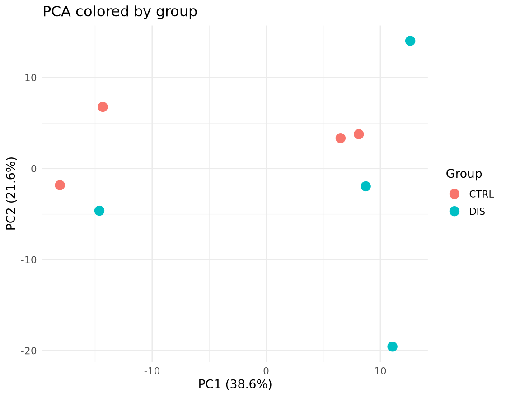
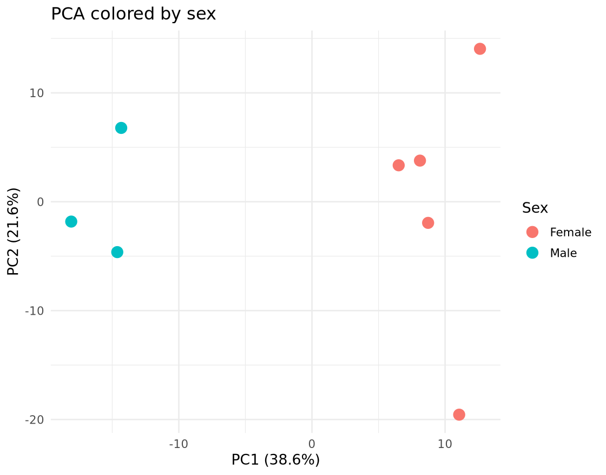
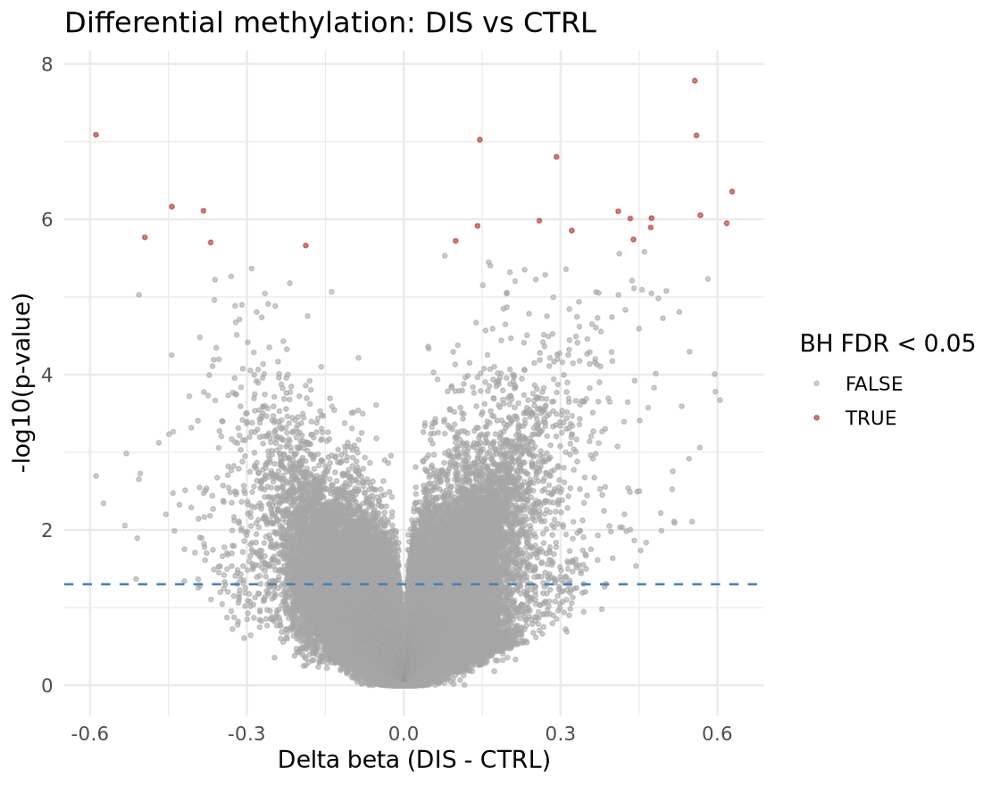

# DNA Methylation Analysis with `minfi`

This repository presents an exploratory Illumina HumanMethylation450 analysis of an eight-sample whole-blood subset from [GSE174555](https://www.ncbi.nlm.nih.gov/geo/query/acc.cgi?acc=GSE174555). The subset contains four children with Down syndrome and four typically developing controls. In the course sample sheet, these groups are labelled `DIS` and `CTRL`, respectively.

The workflow covers raw IDAT import, fluorescence extraction, quality control, `preprocessNoob` normalization, principal component analysis, differential methylation testing, multiple-testing correction, probe annotation, and visualization.

## Analysis overview

1. Import paired red and green IDAT files with `minfi`.
2. Extract fluorescence values and identify the probe at assigned address `72769420`.
3. Review array-level quality metrics and detection p-values.
4. Normalize the data with `preprocessNoob`.
5. Retain probes passing the course-assigned detection threshold of 0.05 in every sample.
6. Explore sample structure using PCA on the 10,000 most variable retained probes.
7. Test normalized M-values with `dmpFinder(shrinkVar = TRUE)` and report delta-beta effect sizes.
8. Apply Benjamini-Hochberg and Bonferroni corrections and annotate the leading probes.

## Main observations

- All eight samples were retained. Individual arrays had between 0.042% and 0.563% failed positions at the assigned detection threshold.
- Detection and finite-value filtering retained 481,451 of 485,512 probes.
- PC1 and PC2 explained 38.6% and 21.6% of the variance among the 10,000 most variable retained probes.
- The PCA did not show complete separation by biological group. It did show a clear sex-associated pattern, so sex is a potential source of confounding in this small subset.
- The exploratory unadjusted group comparison identified 22 probes at Benjamini-Hochberg FDR < 0.05 and 4 probes after Bonferroni correction.







These results are descriptive and hypothesis-generating. They do not establish causal effects, diagnostic biomarkers, or validated Down-syndrome-associated methylation changes.

## Repository contents

```text
.
├── dna_methylation_minfi_workflow.ipynb
├── data/
│   └── SampleSheet_Report_II.csv
├── figures/
│   ├── manhattan_plot.png
│   ├── pca_by_group.png
│   ├── pca_by_sentrix_id.png
│   ├── pca_by_sex.png
│   ├── top_100_heatmap.png
│   └── volcano_plot.png
└── results/
    ├── sample_detection_summary.csv
    └── top_100_dmp_results.csv
```

## Data availability

The raw IDAT files are not stored in this repository. They are available from the public [GSE174555 GEO record](https://www.ncbi.nlm.nih.gov/geo/query/acc.cgi?acc=GSE174555). The notebook uses these eight accessions:

`GSM5319592`, `GSM5319603`, `GSM5319604`, `GSM5319607`, `GSM5319609`, `GSM5319613`, `GSM5319615`, and `GSM5319616`.

To rerun the notebook, place the course-provided `Input_Data_Files.zip` beside the notebook. The archive and extracted IDAT files are excluded by `.gitignore`.

## Authorship and contribution

This analysis was completed collaboratively as a Group 9 course project. My assigned individual responsibility was Step 3: extracting fluorescence values for address `72769420` and identifying its probe information.

This repository is a cleaned portfolio adaptation of the course notebook. It preserves the group-project attribution while correcting the dataset description, PCA interpretation, probe filtering, small-sample variance setting, and differential-analysis scale.

## Limitations

- The analysis uses only eight samples from a larger 34-sample dataset.
- The sex distribution is not perfectly balanced between groups, and the PCA shows sex-associated structure.
- The `dmpFinder` group test does not adjust for sex, blood-cell composition, age, or other covariates.
- No independent cohort or laboratory experiment was used for validation.
- The detection threshold of 0.05 was assigned for the course workflow and is less stringent than the 0.01 threshold commonly used in methylation-array analyses.

## References

- [GSE174555: DNA Methylation Alterations in Blood Cells of Toddlers with Down Syndrome](https://www.ncbi.nlm.nih.gov/geo/query/acc.cgi?acc=GSE174555)
- [Official `minfi` package manual](https://bioconductor.org/packages/release/bioc/manuals/minfi/man/minfi.pdf)
- [Aryee et al. (2014), *minfi*: a flexible and comprehensive Bioconductor package](https://doi.org/10.1093/bioinformatics/btu049)
- [Du et al. (2010), comparison of beta-value and M-value methods](https://pmc.ncbi.nlm.nih.gov/articles/PMC3012676/)

